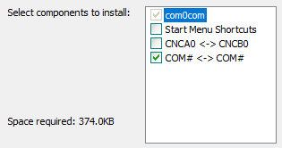
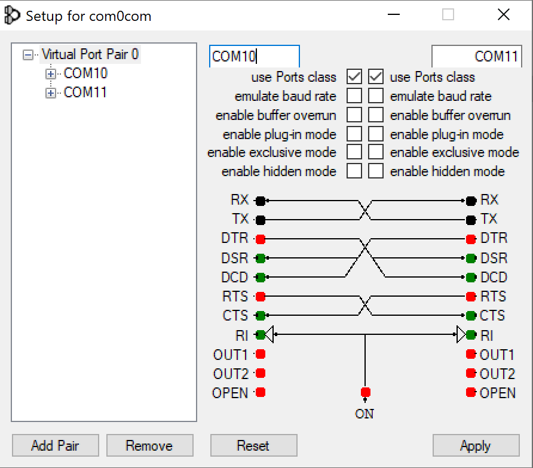
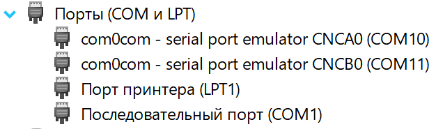
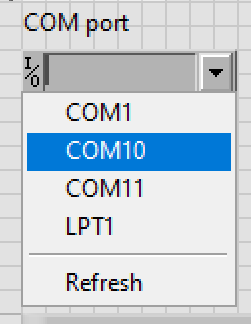
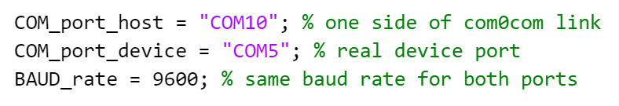
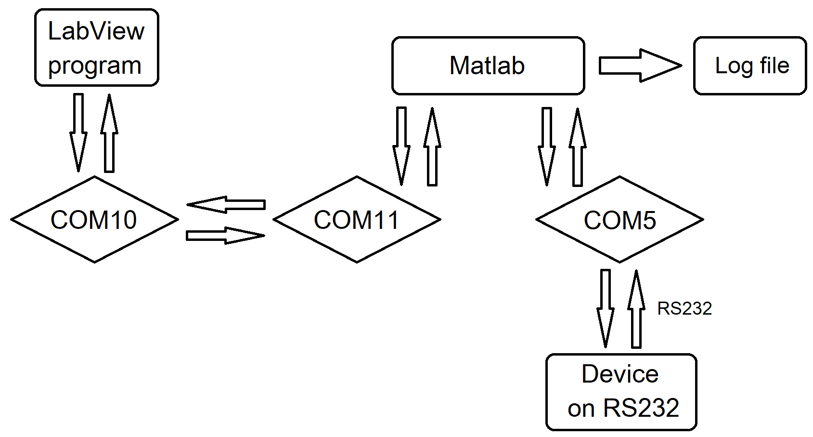

# COM listener V1.0
Matlab script for intercepting messages between host computer and any device via RS232.

## Dependences
 - com0com ([download](https://sourceforge.net/projects/com0com/))

## Usage
1) Install com0com.

2) Run com0com/setupg.exe and set linked port numbers (if you don't want to use the default ones)

3) Make sure the two new ports are available in Device Manager.

4) In your main control program, select one of the linked ports as the port for communicating with the device.

5) In the script settings:
- set COM_port_host to the second linked port.
- set COM_port_device to the port to which the device is connected.
- set BAUD_rate to the value required for the device to operate properly.

- An example of the resulting communication diagram:

